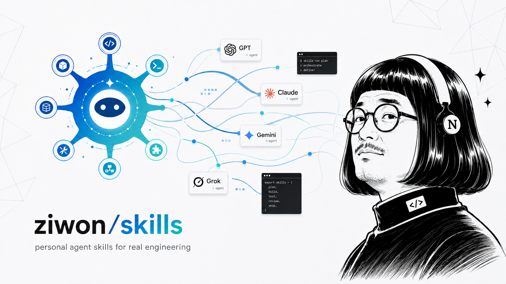

# ziwon/skills

My personal agent skills for real engineering — not vibe coding.



Small, composable, model-agnostic skills I use to keep an agent aligned, fed with
feedback, and honest about design. Built on the philosophy of
[`mattpocock/skills`](https://github.com/mattpocock/skills), kept purely personal.

The principles these skills enforce live in **[AGENTS.md](./AGENTS.md)**.

## Install

### Install my skills

```sh
npx skills@latest add ziwon/skills --agent codex claude-code --global --all
```

Omit `--global` to install into the current project instead.

### Restore optional upstream skills

This repo does not vendor third-party skills. Optional upstream skills are recorded in
`skills-lock.json`; restore them in a cloned checkout:

```sh
git clone https://github.com/ziwon/skills.git ~/Workspace/ziwon/skills
cd ~/Workspace/ziwon/skills
just sync
```

Skills become available in your agent with a `/ziwon:` prefix (e.g. `/ziwon:my-skill`),
from the plugin name in `.claude-plugin/plugin.json`.

## Task runner (`just`)

Third-party skill management is a thin `just` wrapper around
[`npx skills@latest`](https://skills.sh) — same shape as `uv add` / `uv sync`. It only
ever touches `skills-lock.json` and the gitignored `.agents/skills/` / `.claude/skills/`
install dirs, never the tracked `skills/<category>/` tree.

| Command | What it does |
| --- | --- |
| `just add <repo>` | Register + install a third-party skill package (adds to `skills-lock.json`) |
| `just sync` | Restore every skill in `skills-lock.json` (e.g. after a fresh clone) |
| `just update [names...]` | Update installed third-party skills; omit names to update all |
| `just list` | List currently installed skills |
| `just remove [names...]` | Remove third-party skills; omit names for the interactive picker |
| `just validate` | Lint every `SKILL.md` under `skills/` |
| `just link` | Expose `skills/**/SKILL.md` through `.agents/skills/` |
| `just install-hooks` | Install git hooks that re-run `link` on merge/checkout |

## Repository layout

```
skills/
├── engineering/      # code-work skills
├── design/           # visual systems, decks, UI artifact skills
├── productivity/     # general workflow skills
└── misc/             # rarely-used utilities
docs/adr/             # architecture decision records (form: docs/adr/0000-template.md)
templates/            # SKILL.md.template — starting point for new skills
scripts/              # validate-skills.sh and friends
justfile              # task runner: add/sync/update/list/remove third-party skills
skills-lock.json      # third-party skill sources, restored via `just sync`
AGENTS.md             # ★ source of truth: my engineering philosophy + conventions
CLAUDE.md             # → pointer to AGENTS.md
CONTEXT.md            # ubiquitous language for THIS repo (not my style, not app domains)
```

## Adding a skill

```sh
cp templates/SKILL.md.template skills/<category>/<skill-name>/SKILL.md
# edit it: kebab-case folder name == frontmatter `name`
bash scripts/validate-skills.sh
```

The `description` frontmatter is the trigger mechanism — be explicit about *when* the
skill should fire. Keep `SKILL.md` under ~500 lines; push detail into a `references/`
folder beside it and point to it.

## License

[MIT](./LICENSE)
