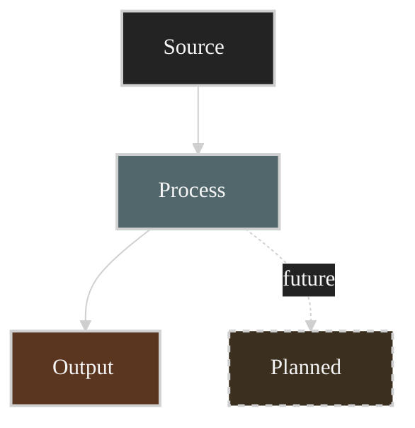

# Mermaid Dark Theme

A dark-first Mermaid style: near-black canvas, light grey hairlines, light text, and a
small set of reusable category colors applied with `classDef`. The goal is calm,
high-contrast architecture diagrams that read well on dark README/Obsidian/slide
backgrounds.

## When this runs

Any time I want a Mermaid diagram and haven't asked for the stock light theme. Reach for
this for flowcharts, system/architecture diagrams, sequence, state, ER, and class
diagrams. The init theme applies to every diagram type; `classDef` is only added where
that diagram grammar supports it (most reliably flowcharts).

## The canonical header

Start every diagram with this init directive (it must be the first line, on its own):

```text
%%{init: {"theme": "base", "themeVariables": {"background": "#171717", "primaryColor": "#232323", "primaryTextColor": "#f5f5f5", "primaryBorderColor": "#d0d0d0", "lineColor": "#cfcfcf", "fontFamily": "Inter, Arial, sans-serif"}}}%%
```

- Use `theme: "base"` so the canonical palette is not mixed with another built-in theme's
  opinionated colors.
- Keep the header on a single line. Mermaid's directive parser is whitespace-sensitive.

## Palette

| Token              | Hex       | Role                                    |
| ------------------ | --------- | --------------------------------------- |
| background         | `#171717` | diagram canvas                          |
| primaryColor       | `#232323` | default node fill                       |
| primaryTextColor   | `#f5f5f5` | node + label text                       |
| primaryBorderColor | `#d0d0d0` | node borders                            |
| lineColor          | `#cfcfcf` | edges / arrows                          |

All category fills below pair with `stroke:#d0d0d0`, `color:#f5f5f5`, `stroke-width:2px`.

## classDef library — copy these verbatim

```text
  classDef input    fill:#232323,stroke:#d0d0d0,color:#f5f5f5,stroke-width:2px;
  classDef analysis fill:#52676b,stroke:#d0d0d0,color:#f5f5f5,stroke-width:2px;
  classDef accent   fill:#1b070a,stroke:#d0d0d0,color:#f5f5f5,stroke-width:2px;
  classDef music    fill:#62164d,stroke:#d0d0d0,color:#f5f5f5,stroke-width:2px;
  classDef evidence fill:#173f32,stroke:#d0d0d0,color:#f5f5f5,stroke-width:2px;
  classDef render   fill:#5a3520,stroke:#d0d0d0,color:#f5f5f5,stroke-width:2px;
  classDef planned  fill:#3b2f20,stroke:#d0d0d0,color:#f5f5f5,stroke-width:2px,stroke-dasharray:5 5;
```

What each color signals (rename freely per domain — keep the hex):

- **input** `#232323` — neutral entry points / sources (same as default fill, just explicit).
- **analysis** `#52676b` — muted teal-grey: processing, compute, transforms.
- **accent** `#1b070a` — deep maroon: the focal / primary actor.
- **music** `#62164d` — magenta: a distinct parallel concern.
- **evidence** `#173f32` — green: outputs that are trusted / logged / verified.
- **render** `#5a3520` — warm brown: terminal outputs, UI, artifacts.
- **planned** `#3b2f20` + dashed border — not-yet-built / future work.

Apply with `class A,B input;` lines after the `classDef` block. Use **dotted edges**
(`A -. "label" .-> B`) for planned/optional/feedback flows to match the dashed `planned`
nodes.

## Procedure

1. Emit the `%%{init}%%` header verbatim as line 1.
2. Write the diagram body (`flowchart TD`, `sequenceDiagram`, etc.).
3. For flowcharts, append only the `classDef` lines you actually use, then the
   `class … ;` assignments. For sequence, ER, class, or another grammar, use only syntax
   supported by that diagram type; never paste flowchart `classDef` statements blindly.
4. Use solid arrows for real flows, dotted (`-.->`)  for planned/optional/loops.
5. Wrap long node labels with `<br/>` instead of letting them overflow.
6. Fence the whole thing in a ```mermaid block so it renders in GitHub/Obsidian.

## Verify before delivering

Mermaid syntax errors render as a red error box, not a diagram — so confirm it parses:

- Quote any label containing spaces, `/`, `+`, or punctuation: `A["Lead Sheet / MIDI"]`.
- Keep the init directive on one line; a wrapped directive silently disables the theme.
- If a renderer is available (`@mermaid-js/mermaid-cli`: `mmdc -i d.mmd -o d.svg`, or paste
  into mermaid.live), render once and eyeball it before calling it done.

## Minimal template



A fuller, annotated example lives in `assets/example.md`.

## Guardrails

- Don't drop the `%%{init}%%` header — without it rendering falls back to the host/default
  Mermaid theme rather than this canonical palette.
- Don't introduce new fills ad hoc; extend the palette deliberately and reuse hexes so
  diagrams stay visually consistent across a repo.
- Don't use emoji inside nodes; keep labels plain text with `<br/>` line breaks.
- This is a style layer only — it never changes diagram semantics.
