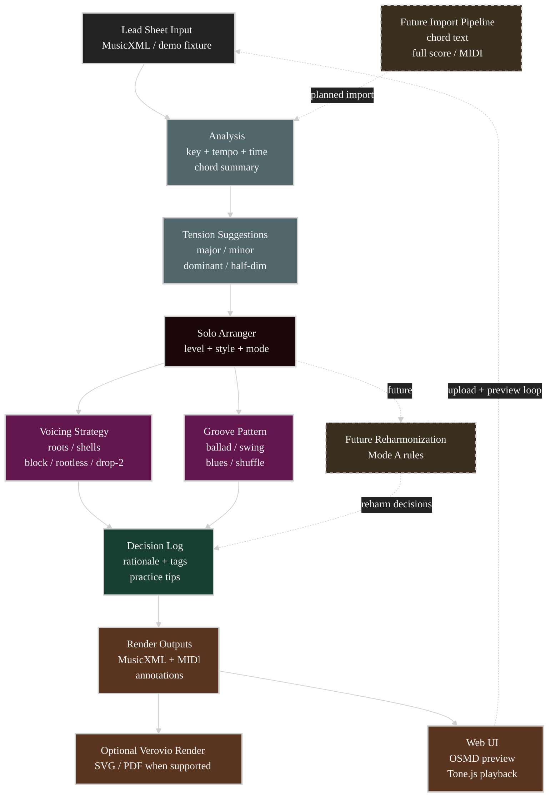

# Mermaid Dark Theme — full example

The flowchart reference this skill is modeled on. Every category color and the dotted
"planned/future" edge convention is exercised here. Other Mermaid diagram grammars keep
the init theme but must use their own supported styling syntax rather than copying these
flowchart `classDef` statements.

Note: `arranger` here is the same hex as `accent` in SKILL.md (`#1b070a`) — rename the
class to fit the domain, keep the hex so the palette stays consistent.
